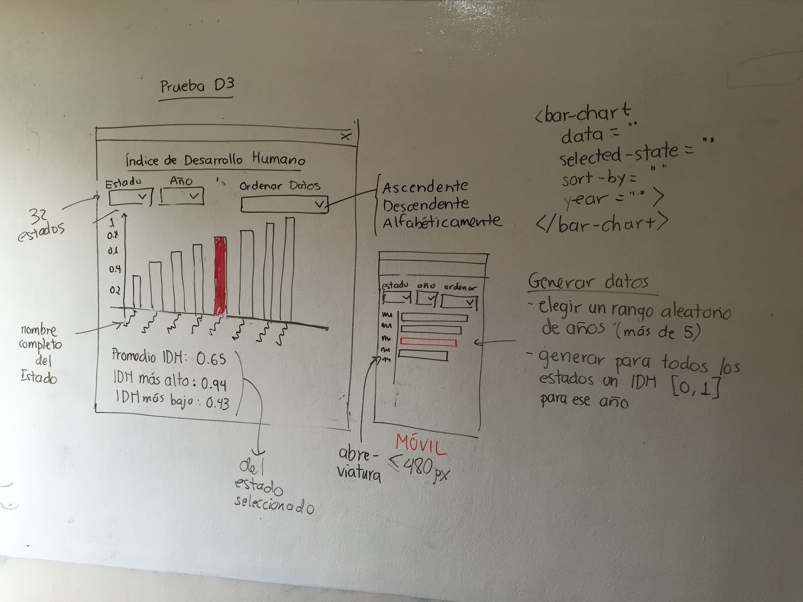

# Prueba D3 - Índice de Desarrollo Humano

Desplegar una gráfica de barras en la que se muestran los valores del Índice de Desarrollo Humano de las 32 entidades de México.

En la parte superior se ubican 3 dropdowns que permiten:

1. Seleccionar un estado
2. Seleccionar un año
3. Ordenar los datos (alfabéticamente (A - Z) | ascendente (0 - 1) | descendente (1 - 0))

## Datos

Generar aleatoriamente los datos para las gráficas en cuanto se carga la página

1. Elegir un rango aleatorio de años (más de 5)
2. Cada año deberá tener datos para las 32 entidades
3. Dar a cada entidad y año un valor aleatorio al IDH entre 0 y 1 (usar decimales)

## Gráfica

Generar la lógica haciendo uso de los siguientes atributos:

1. data: un Arreglo de objetos con los datos con los que se pintará la gráfica
2. selectedYear: año que se quiere visualizar
3. selectedState: Estado seleccionado -> destacar la barra de este estado con un color distinto
4. sort: forma de ordenar los datos

## UX

Hacer la interfaz responsiva utilizando Materialize o Bootstrap.

La gráfica debe redibujarse cuando cambie el estado seleccionado, el año o la forma de ordenamiento, sin necesidad de botones adicionales.

## Plus

1. Instalar dependencias usando npm

## Entrega

1. Comentar y explicar el código.
2. Compartir el repositorio de Git en el que esté el código
3. Si es posible, subir el proyecto usando un PaaS como Heroku u OpenShift. (opcional)

## Mockup

